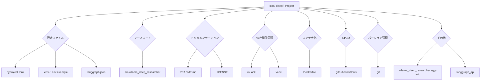

# local-deepR リポジトリ構造解説

このドキュメントは `local-deepR` プロジェクトの全体像を理解するための視覚的な資料です。プロジェクトの主要なファイルとディレクトリの目的と役割について解説します。

## 構造図 (Mermaid)

## 各ファイル/ディレクトリの目的

### 最上位ファイル

| ファイル名 | 目的 |
| :--- | :--- |
| **.env** | ローカル環境でのみ使用する環境変数（APIキーなど）を定義します。このファイルはGitリポジトリには含まれません。 |
| **.env.example** | `.env` ファイルのテンプレートです。どのような環境変数を設定する必要があるかを示します。 |
| **Dockerfile** | アプリケーションをDockerコンテナとしてビルド、実行するための設定ファイルです。 |
| **langgraph.json** | [LangGraph](https://langchain-ai.github.io/langgraph/)フレームワークが使用するグラフの構造をJSON形式で定義したファイルです。 |
| **LICENSE** | このプロジェクトのライセンス（利用許諾条件）を記載したファイルです。 |
| **pyproject.toml** | Pythonプロジェクトのモダンな設定ファイルです。プロジェクトのメタデータ、依存ライブラリ、ビルド設定などを一元管理します。 |
| **README.md** | プロジェクトの概要、使い方、セットアップ方法などを記載したメインのドキュメントです。 |
| **uv.lock** | `uv`（高速なPythonパッケージインストーラ）が生成するロックファイルです。依存関係のバージョンを固定し、誰が実行しても同じ環境を再現できるようにします。 |

### ディレクトリ

| ディレクトリ名 | 目的 |
| :--- | :--- |
| **.git/** | Gitがリポジトリのバージョン管理に使用するすべての情報を格納するディレクトリです。 |
| **.github/workflows/** | GitHub Actionsのワークフロー定義ファイルが格納されています。CI/CD（継続的インテグレーション/継続的デリバリー）パイプラインを自動化します。 |
| **.langgraph_api/** | LangGraphに関連するAPIの情報やキャッシュなどが保存される可能性があります。 |
| **.venv/** | Pythonの仮想環境です。プロジェクト固有のライブラリがインストールされ、システム全体のPython環境から隔離されます。 |
| **docs/** | プロジェクトのドキュメンテーション（このファイルなど）を格納するディレクトリです。 |
| **ollama_deep_researcher.egg-info/** | Pythonパッケージがインストールされた際に生成されるメタデータディレクトリです。 |
| **src/ollama_deep_researcher/** | アプリケーションのメインとなるPythonのソースコードが格納されているディレクトリです。 |
